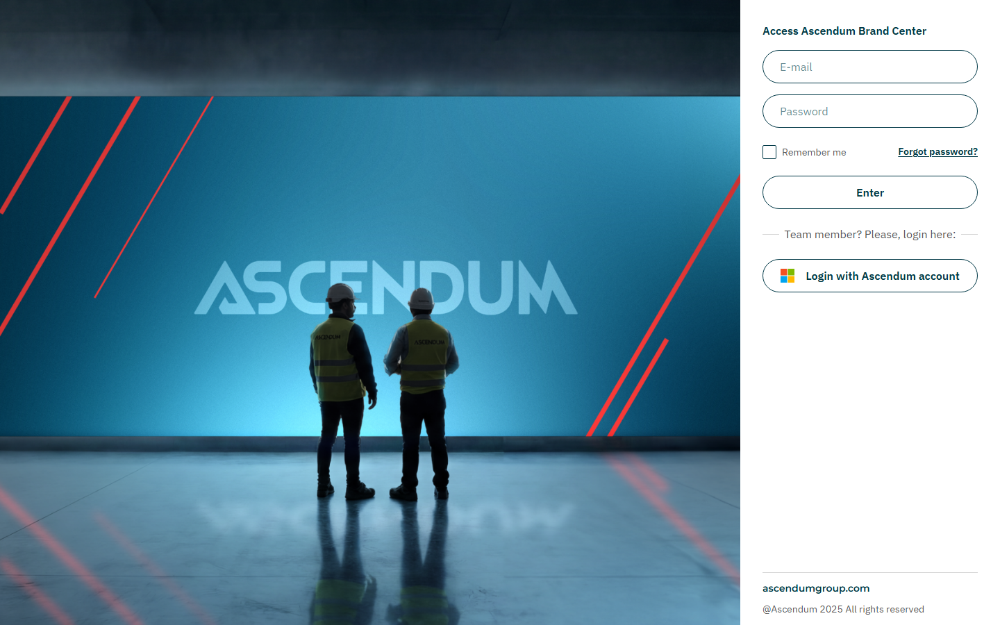
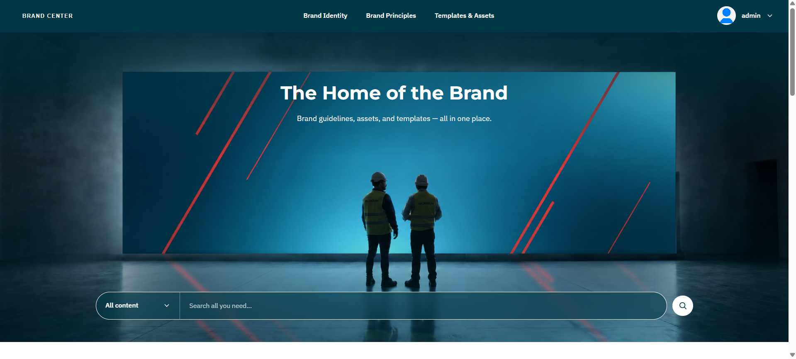
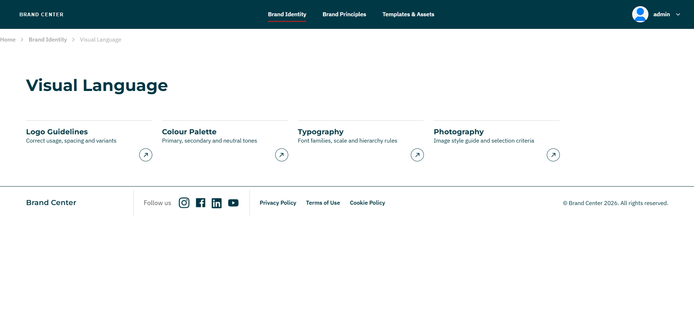
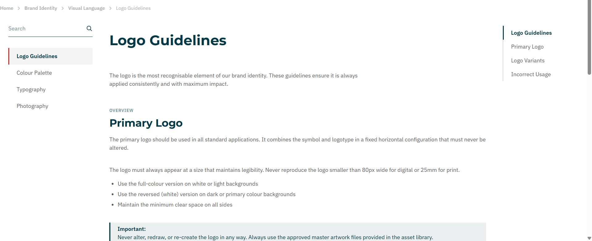
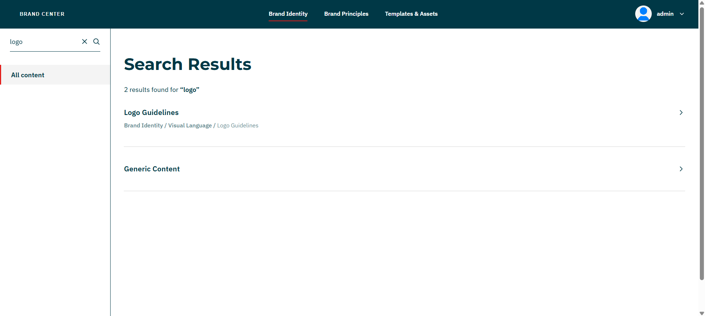
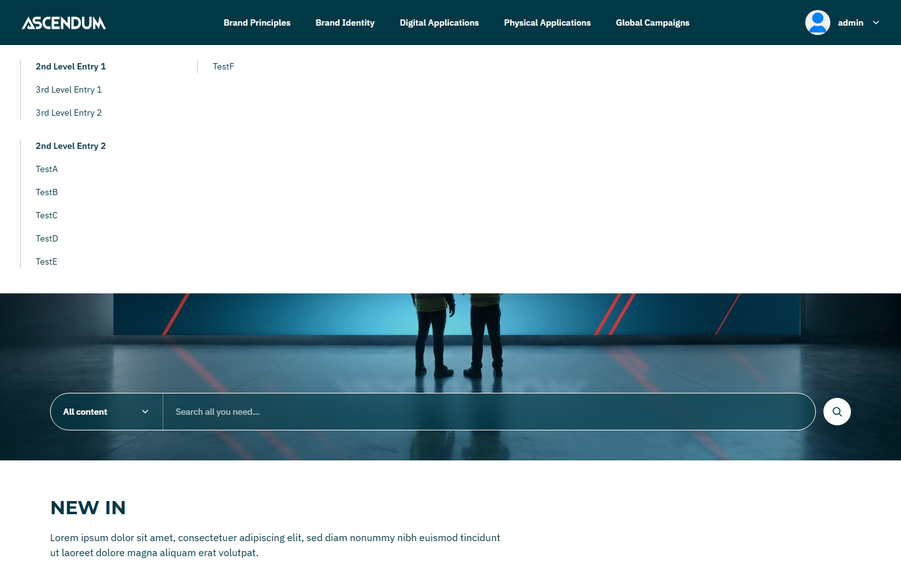
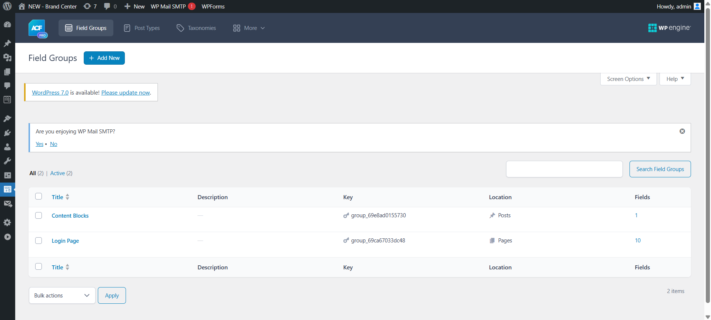
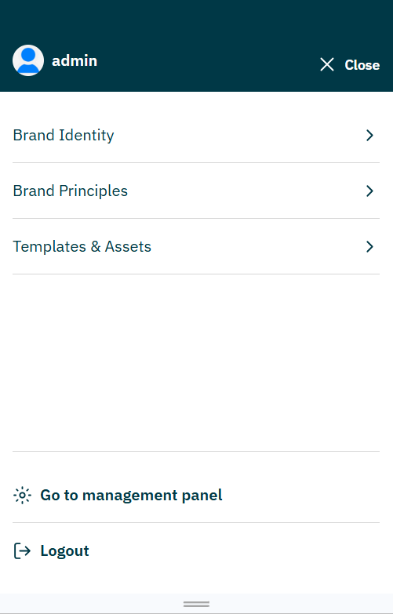

# Brand Center — WordPress

A private digital platform centralising brand guidelines and assets for a multi-brand corporate group. Built as a parallel implementation alongside a [Next.js + Payload CMS version](https://github.com/lourencosilvabeato/Brand-Center-Payload-Implementation) — same functional requirements, same Figma designs, same Confluence specifications — implemented on a different technology stack to evaluate AI-assisted development across different CMS environments.

> Implemented with [Claude Code](https://claude.ai/code) as the primary development tool — Confluence, Figma, and Miro MCP integrations provided live access to specifications, designs, and IA diagrams throughout each session.

---

## Overview

Brand Center gives a corporate group and its sub-brands a single authenticated space for brand guidelines, downloadable assets, and editorial content. The platform serves two distinct user types: internal collaborators who sign in via Microsoft Azure AD / O365, and invited external users — agencies, suppliers, and partners — who use WordPress's built-in email+password authentication.

Content is entirely CMS-driven through the WordPress Admin UI. Editors compose pages from a library of ACF blocks assembled as "lego pieces" in the back office. A four-level page hierarchy driven by WordPress menus controls every navigation component simultaneously — mega-menu, mobile menu, left sidebar, and breadcrumb — from a single source of truth.

---

## Screenshots

| | |
|---|---|
|  |  |
| Login — SSO + email/password | Homepage |
|  |  |
| Channel page — child card grid | Content page — block layout + anchor bar |
|  |  |
| Search results | Mega-menu — 3-level navigation |
|  |  |
| WordPress Admin — ACF block management | Mobile menu |

---

## Key Features

**Dual Authentication and Role System**
Internal users authenticate via Azure AD / O365 OAuth through a custom SSO handler. External users are invited by admins or local admins and authenticate with WordPress's built-in email+password. Four roles — Admin, Local Admin, Internal, External — control what each user can access and what actions they can take.

**Secure Token Flows**
Invite links, password recovery, and admin-initiated resets share the same pattern: a hashed token stored with a 24-hour expiry. Raw tokens are never persisted.

**ACF Block-Based Content Pages**
Editors compose interior pages from 11 ACF blocks — paragraph, quote, note/callout, table, grid cards, divider, collection, collection detail, icon library, page header, and section top. All editorial content is field-driven with no hardcoded copy in templates.

**Navigation-Driven Layout**
A four-level page hierarchy lives in WordPress menus and simultaneously drives the mega-menu, mobile menu, left sidebar, and breadcrumb. Breadcrumb visibility is governed by menu membership — pages outside the main nav (FAQs, Contact) never show a breadcrumb even if they have a WordPress parent.

**Protected File Downloads**
Brand assets are restricted to authenticated users. Download requests are gated — unauthenticated requests are rejected before the file stream opens.

**Transactional Email**
Four email triggers — invite, password recovery, admin-initiated reset, and contact form — all route through a single PHP email handler. No email logic is duplicated across templates.

---

## Tech Stack

| Layer | Technology | Rationale |
|---|---|---|
| CMS | WordPress (latest stable) | Industry-standard PHP CMS with a mature plugin ecosystem |
| Language | PHP | Server-rendered templates, no build step required |
| Database | MySQL | WordPress default — managed by WP core |
| Content Fields | ACF Pro (Advanced Custom Fields) | Flexible block registration and field group management |
| Auth — Internal | Azure AD / O365 OAuth (custom handler) | SSO for internal users via `inc/sso.php` |
| Auth — External | WordPress built-in email+password | Invite-only onboarding using WP's native user management |
| Styling | CSS custom properties + per-component stylesheets | Design tokens via CSS variables, scoped per template — no framework |
| JavaScript | Vanilla ES6+ | Anchor bar scrollspy, header interactions, homepage behaviour |
| Hosting | Siteground | STG and PROD environments |

---

## Architecture

```
Browser (server-rendered HTML)
        ↕  HTTP requests
WordPress (PHP page templates + ACF blocks)
        ↕  WP Query / WP_User / custom functions
MySQL
        ↕
Azure AD (SSO)     SMTP (transactional email)
```

**Key architectural principles:**

- WordPress runs as a traditional server-rendered application — no client-side framework or API layer
- Every page maps to a dedicated **page template** (`page-{slug}.php`) following the WordPress template hierarchy
- All flexible content uses **ACF blocks** registered in `inc/blocks.php` — each block has its own PHP template and ACF field group
- Authentication converges on a single **WordPress session cookie** regardless of login method (SSO or email+password)
- The **SSO handler** (`inc/sso.php`) manages the Azure AD OAuth flow, maps O365 users to WordPress roles, and sets the WP auth cookie on success

---

## AI Integration

This project was built entirely using **Claude Code** (Anthropic's CLI agent) as the primary implementation tool, driven by the same structured prompt library approach as the Payload version.

The repository includes a `CLAUDE-WordPress.md` file — a persistent context document encoding the full technical specification, design token values, WordPress coding conventions, and a 6-step per-requirement workflow connecting three MCP-integrated tools:

1. **Confluence MCP** — fetches the functional specification for each requirement
2. **Figma MCP** — reads component designs and design tokens directly from the Figma file
3. **Miro MCP** — accesses IA diagrams, navigation flow specs, and component assembly rules

Each feature was implemented by prompting Claude Code with a requirement reference. Claude would fetch the Confluence spec, read the Figma design, implement the feature end-to-end in WordPress/PHP, and commit to the correct feature branch — all in one session.

---

## Project Structure

```
wp-content/
├── plugins/
│   └── advanced-custom-fields-pro/     — ACF Pro plugin (block & field registration)
└── themes/
    └── ascendum-brand-center/
        ├── assets/
        │   ├── css/                    — Per-component stylesheets
        │   │   ├── breadcrumb.css
        │   │   ├── channel.css
        │   │   ├── footer.css
        │   │   ├── header.css
        │   │   ├── homepage.css
        │   │   ├── login.css
        │   │   ├── sidebar.css
        │   │   └── ...
        │   ├── images/                 — Theme images (logo, default avatar)
        │   └── js/                     — Vanilla JS modules
        │       ├── anchor-bar.js       — Scrollspy for anchor navigation
        │       ├── header.js           — Mega-menu and mobile menu interactions
        │       ├── homepage.js         — Homepage-specific behaviour
        │       └── icon-library.js     — Icon library viewer
        ├── blocks/                     — ACF block templates (11 blocks)
        │   ├── collection.php
        │   ├── collection-detail.php
        │   ├── divider.php
        │   ├── grid-cards.php
        │   ├── icon-library.php
        │   ├── note.php
        │   ├── page-header.php
        │   ├── paragraph.php
        │   ├── quote.php
        │   ├── section-top.php
        │   └── table-block.php
        ├── inc/                        — Modular include files
        │   ├── blocks.php              — ACF block registration
        │   ├── channel.php             — Channel page logic
        │   ├── email.php               — Transactional email handler
        │   ├── nav.php                 — Navigation helpers (mega-menu, breadcrumb, sidebar)
        │   └── sso.php                 — Azure AD OAuth flow
        ├── page-change-password.php    — A05: Change password
        ├── page-channel.php            — C01: Channel landing page
        ├── page-expired-link.php       — Token expiry feedback
        ├── page-generic-content.php    — C02: Block-composed content page
        ├── page-homepage.php           — B01: Homepage
        ├── page-invite-user.php        — A02: Invite external user
        ├── page-login.php              — A01: Login (SSO + email/password)
        ├── page-password-recovery.php  — A03: Password recovery request
        ├── page-reset-password.php     — A03/A04: Reset password
        ├── page-set-password.php       — A02: Set password (invite flow)
        ├── footer.php                  — Global footer
        ├── header.php                  — Global header
        ├── sidebar.php                 — Left sidebar
        ├── functions.php               — Theme bootstrap and hook registration
        ├── index.php                   — Fallback template
        └── style.css                   — Theme declaration + design tokens
```

---

## Getting Started

### Prerequisites

- WordPress (latest stable)
- PHP 8.0 or higher
- MySQL 8.0 or higher
- ACF Pro licence and plugin installed

### Installation

1. Clone this repository into your WordPress installation:

```bash
git clone https://github.com/lourencosilvabeato-blip/Brand-Center---WordPress.git
```

2. Copy the theme to your WordPress themes directory:

```bash
cp -r wp-content/themes/ascendum-brand-center /path/to/wordpress/wp-content/themes/
cp -r wp-content/plugins/advanced-custom-fields-pro /path/to/wordpress/wp-content/plugins/
```

3. In WordPress Admin → Appearance → Themes, activate **Brand Center**.

4. In WordPress Admin → Plugins, activate **Advanced Custom Fields Pro**.

### Configuration

Configure the following in `wp-config.php` or via environment variables:

| Constant | Required | Description |
|---|---|---|
| `AZURE_CLIENT_ID` | Yes (for SSO) | Azure AD App Registration client ID |
| `AZURE_CLIENT_SECRET` | Yes (for SSO) | Azure AD App Registration client secret |
| `AZURE_TENANT_ID` | Yes (for SSO) | Azure AD directory (tenant) ID |
| `AZURE_REDIRECT_URI` | Yes (for SSO) | Must match a Redirect URI registered in Azure |
| `SMTP_HOST` | Yes (for email) | SMTP server hostname |
| `SMTP_USER` | Yes (for email) | SMTP username |
| `SMTP_PASS` | Yes (for email) | SMTP password or API key |
| `EMAIL_FROM` | No | Sender address — falls back to admin email |

### WordPress Admin Setup

After activation, create the following pages in WordPress Admin → Pages and assign their templates:

| Page slug | Template |
|---|---|
| `login` | Login (page-login.php) |
| `homepage` | Homepage (page-homepage.php) |
| `invite-user` | Invite User (page-invite-user.php) |
| `change-password` | Change Password (page-change-password.php) |
| `password-recovery` | Password Recovery (page-password-recovery.php) |

Configure the WordPress navigation menu to reflect the 4-level content hierarchy — all breadcrumb, sidebar, and mega-menu behaviour is driven from this menu automatically.

---

## Scope and Roadmap

**Implemented:** Full authentication lifecycle (SSO, invite, password recovery, admin reset, change password, logout), ACF block-based content pages (11 block types), channel landing pages, 4-level navigation, mega-menu and mobile menu, left sidebar and anchor bar, homepage, contact form, protected file access, and 404 page.

**Parallel implementation:** The [Payload CMS version](https://github.com/lourencosilvabeato/Brand-Center-Payload-Implementation) was built against the same requirements, Figma file, and Confluence specs — a direct CMS-to-CMS comparison of AI-assisted development capability and output quality.

---

## Development Approach

- Architected and implemented with [Claude Code](https://claude.ai/code) using `CLAUDE-WordPress.md` as persistent project context across sessions
- Specification-driven: each feature was implemented by fetching the Confluence spec and Figma design via MCP before writing any code
- Same functional brief, Figma file, and Confluence specifications as the Payload version — enabling a direct comparison of implementation effort, code structure, and AI output quality across two different CMS stacks
- Feature branches with structured commit messages for full traceability
